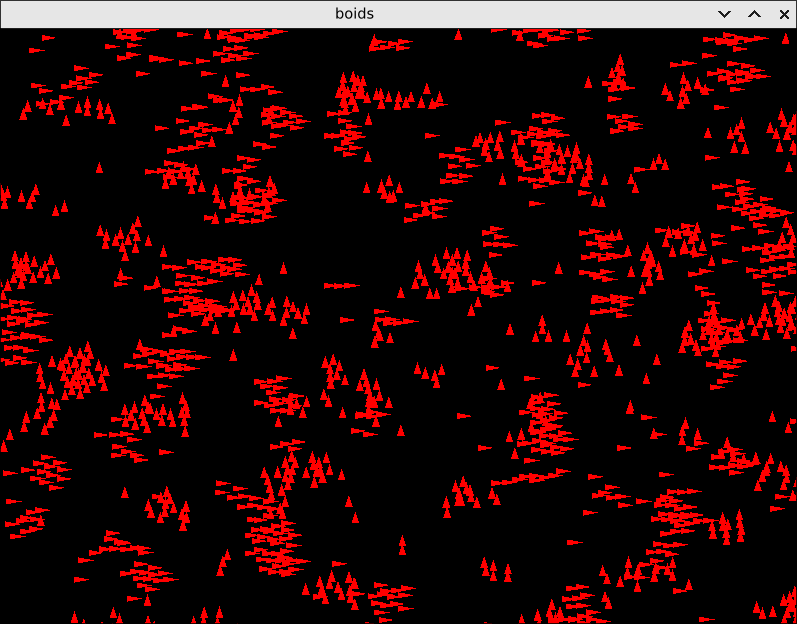

# Boids ported from wgpu to rust-gpu

Original: https://github.com/gfx-rs/wgpu/tree/master/wgpu/examples/boids

`wgpu` is Rust's main GPU project and `rust-gpu` is a project to write GPU shaders in Rust.

This repo is a simple example of writing an entire GPU application in Rust, with both vertex and non-vertex compute code.

## Run

`cargo run` or `cargo run --release` for a bit more performance.

## TODO

There's still a lot of cruft from the `wgpu` version, so the code could be simplified even more
